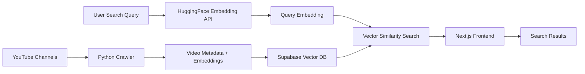

# YouTube Search 🔍

AI-powered YouTube video discovery using semantic search. Find videos by meaning and content, not just titles and keywords.

## 🎯 What it does

This application enables intelligent YouTube video search through:
- **Semantic understanding**: Search for concepts, topics, and ideas rather than exact word matches
- **AI-powered embeddings**: Uses sentence transformers to understand content meaning
- **Vector similarity search**: Finds videos with similar content even if they use different words

## 🏗️ Architecture & Flow



### Components

**🐍 Crawler** (`/crawler/`)
- Searches and processes YouTube channels automatically
- Extracts video metadata (titles, descriptions, URLs)
- Generates semantic embeddings for each video
- Stores everything directly in Supabase vector database

**🌐 Frontend** (`/app/`, `/components/`, `/lib/`)
- Next.js application with modern React components
- Real-time search interface with smooth animations
- Connects to Supabase for vector similarity search
- Uses HuggingFace API for query embedding generation

**🤖 Embedding Service** (`/huggingface-space/`)
- Gradio + FastAPI application for HuggingFace Spaces
- Provides embedding generation API using sentence transformers
- Processes search queries to create vector representations

## 🚀 Quick Setup

### 1. Prerequisites

- **Node.js 18+** for the frontend
- **Python 3.9+** for the crawler
- **Supabase account** for vector database
- **HuggingFace account** for embedding service (optional, can run locally)

### 2. Database Setup

Create a Supabase project and run these SQL commands:

```sql
-- Enable vector extension
CREATE EXTENSION IF NOT EXISTS vector;

-- Documents table for video data
CREATE TABLE documents (
  id UUID DEFAULT gen_random_uuid() PRIMARY KEY,
  content TEXT NOT NULL,
  metadata JSONB DEFAULT '{}',
  embedding VECTOR(384), -- 384 dimensions for sentence-transformers/all-MiniLM-L6-v2
  created_at TIMESTAMP WITH TIME ZONE DEFAULT TIMEZONE('utc'::TEXT, NOW()) NOT NULL
);

-- Indexes for fast similarity search
CREATE INDEX ON documents USING ivfflat (embedding vector_cosine_ops with lists = 100);
CREATE INDEX ON documents USING gin (metadata);

-- Channel tracking table
CREATE TABLE channel_upload_stats (
  id BIGSERIAL PRIMARY KEY,
  channel_url TEXT UNIQUE NOT NULL,
  channel_name TEXT,
  videos_count INTEGER DEFAULT 0,
  data_loaded_at TIMESTAMP WITH TIME ZONE DEFAULT NOW(),

  -- Ensure uniqueness per channel
  UNIQUE(channel_url)
);
```

### 3. Frontend Setup

```bash
# Install dependencies
npm install

# Configure environment
cp .env.example .env.local
# Add your Supabase URL and anon key
# Add your HuggingFace Space URL (or use local embedding)

# Run development server
npm run dev
```

### 4. Crawler Setup

```bash
cd crawler

# Install Python dependencies
pip install -r requirements.txt

# Run the crawler (automated mode)
python crawler.py

# Or manual mode for specific channels
python crawler.py --manual
```

### 5. Embedding Service (Optional)

Deploy to HuggingFace Spaces or run locally:

```bash
cd huggingface-space

# Local development
pip install -r requirements.txt
python app.py

# Or deploy to HuggingFace Spaces
# See DEPLOYMENT.md for detailed instructions
```

## 🎮 Usage

1. **Collect Data**: Run the crawler to gather YouTube video data
   ```bash
   cd crawler && python crawler.py
   ```

2. **Start Frontend**: Launch the search interface
   ```bash
   npm run dev
   ```

3. **Search Videos**: Enter natural language queries like:
   - "machine learning tutorials for beginners"
   - "cooking pasta techniques"
   - "travel videos about Japan"

## 📁 Project Structure

```
youtube-search/
├── app/                    # Next.js app router pages
├── components/             # React components (SearchInterface, VideoCard)
├── lib/                   # Utilities (search, embeddings, types)
├── crawler/               # Python video crawler and embedder
├── huggingface-space/     # Embedding API service
└── docs/                  # Documentation and SQL files
```

## 🔧 Configuration

**Frontend** (`.env.local`):
```env
NEXT_PUBLIC_SUPABASE_URL=your_supabase_url
NEXT_PUBLIC_SUPABASE_ANON_KEY=your_supabase_anon_key
NEXT_PUBLIC_HUGGING_FACE_SPACE_URL=your_hf_space_url
```

**Crawler** (`crawler/config.py`):
```python
MAX_CONCURRENT_VIDEOS = 8      # Adjust for your CPU
EMBEDDING_BATCH_SIZE = 16      # Adjust for your RAM
VIDEO_LIMIT_PER_CHANNEL = 20   # Videos per channel
SUPABASE_ENABLED = True        # Direct database storage
```

## 🛠️ Tech Stack

- **Frontend**: Next.js 15, React 19, TypeScript, Tailwind CSS, Shadcn/ui
- **Backend**: Python, yt-dlp, sentence-transformers, Supabase
- **Database**: PostgreSQL with pgvector extension
- **Deployment**: Netlify (frontend), HuggingFace Spaces (embedding API)

## Licencse
MIT License

Copyright (c) 2025 Timur Cheryapov

Permission is hereby granted, free of charge, to any person obtaining a copy
of this software and associated documentation files (the "Software"), to deal
in the Software without restriction, including without limitation the rights
to use, copy, modify, merge, publish, distribute, sublicense, and/or sell
copies of the Software, and to permit persons to whom the Software is
furnished to do so, subject to the following conditions:

The above copyright notice and this permission notice shall be included in all
copies or substantial portions of the Software.

THE SOFTWARE IS PROVIDED "AS IS", WITHOUT WARRANTY OF ANY KIND, EXPRESS OR
IMPLIED, INCLUDING BUT NOT LIMITED TO THE WARRANTIES OF MERCHANTABILITY,
FITNESS FOR A PARTICULAR PURPOSE AND NONINFRINGEMENT. IN NO EVENT SHALL THE
AUTHORS OR COPYRIGHT HOLDERS BE LIABLE FOR ANY CLAIM, DAMAGES OR OTHER
LIABILITY, WHETHER IN AN ACTION OF CONTRACT, TORT OR OTHERWISE, ARISING FROM,
OUT OF OR IN CONNECTION WITH THE SOFTWARE OR THE USE OR OTHER DEALINGS IN THE
SOFTWARE.
