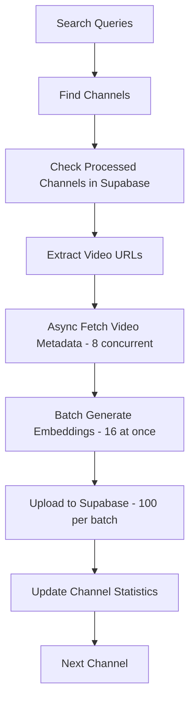

# YouTube Search Crawler 🔍

A high-performance, modular YouTube crawler that extracts video metadata, generates semantic embeddings, and stores data directly in Supabase for intelligent search functionality.

## 🚀 **Features**

### **🎯 Core Functionality**
- **Asynchronous video processing** with configurable concurrency (8 workers by default)
- **Batch embedding generation** for 3-5x faster processing
- **Semantic content extraction** using SmolLM2 for better search relevance
- **Direct Supabase integration** - no intermediate JSON files needed
- **Memory monitoring** with automatic safety mechanisms
- **Intelligent channel tracking** to avoid duplicate processing

### **⚡ Performance Optimizations**
- **Concurrent video fetching** (8 videos simultaneously)
- **Batch embedding processing** (16 embeddings at once)
- **Smart memory management** with automatic cleanup
- **Fallback mechanisms** for reliability

### **🔗 Database Integration**
- **Direct Supabase upload** - data goes straight to your database
- **Real-time channel tracking** - no need for separate JSON files
- **Automatic backup** to JSON files for safety
- **Batch uploads** to handle large datasets efficiently

## 📋 **Prerequisites**

### **Environment Setup**
1. **Python 3.9+** with the following packages:
```bash
pip install yt-dlp sentence-transformers transformers torch supabase tqdm psutil
```

2. **Supabase Database** with the following tables:

#### **`documents` Table**
```sql
CREATE TABLE documents (
  id BIGSERIAL PRIMARY KEY,
  content TEXT NOT NULL,
  metadata JSONB,
  embedding VECTOR(384),
  created_at TIMESTAMP WITH TIME ZONE DEFAULT NOW()
);

-- Index for vector similarity search
CREATE INDEX ON documents USING ivfflat (embedding vector_cosine_ops);

-- Index for metadata queries
CREATE INDEX ON documents USING gin (metadata);
```

#### **`channel_upload_stats` Table**
```sql
CREATE TABLE channel_upload_stats (
  id BIGSERIAL PRIMARY KEY,
  channel_url TEXT UNIQUE NOT NULL,
  channel_name TEXT,
  videos_count INTEGER DEFAULT 0,
  last_updated TIMESTAMP WITH TIME ZONE DEFAULT NOW(),
  found_via_query TEXT
);

-- Index for channel lookup
CREATE INDEX ON channel_upload_stats (channel_url);
```

3. **Environment Variables** (in `.env.local`):
```env
NEXT_PUBLIC_SUPABASE_URL=your_supabase_url
NEXT_PUBLIC_SUPABASE_ANON_KEY=your_supabase_anon_key
```

## 🛠️ **Configuration**

### **Key Settings** (`crawler/config.py`)

```python
# Performance settings (adjust for your hardware)
MAX_CONCURRENT_VIDEOS = 8      # For 8-core systems
EMBEDDING_BATCH_SIZE = 16      # Batch size for embeddings
MAX_CHANNELS_PER_QUERY = 10    # Channels to find per search query
VIDEO_LIMIT_PER_CHANNEL = 20   # Videos to process per channel

# Supabase integration
SUPABASE_ENABLED = True        # Set to False for JSON-only mode
SUPABASE_BATCH_SIZE = 100      # Documents per upload batch

# Search queries for automated mode
SEARCH_QUERIES = [
    "art and painting tutorials",
    "personal finance and investing",
    "travel vlogs and adventure",
    # ... customize for your needs
]
```

### **Hardware Recommendations**

| System Type | MAX_CONCURRENT_VIDEOS | EMBEDDING_BATCH_SIZE | Expected Performance |
|-------------|----------------------|---------------------|---------------------|
| **High-end** (16+ cores, 32GB+ RAM) | 12-16 | 32 | ~30-40 videos/min |
| **Mid-range** (8 cores, 16GB RAM) | 8 | 16 | ~20-30 videos/min |
| **Lower-end** (4 cores, 8GB RAM) | 4 | 8 | ~10-15 videos/min |

## 🎮 **Usage**

### **Automated Mode** (Recommended)
Searches for channels using predefined queries and processes them automatically:

```bash
cd crawler
python crawler.py
```

**Expected Output:**
```
🤖 Starting async automated YouTube crawler...
🔌 Supabase integration enabled - data will be saved directly to database
📊 Current database: 1,247 videos, 42 channels
🚀 Initializing video embedder...
🔍 Searching for channels with query: 'art and painting tutorials'
📡 Processing channel: Art Studio Learning (https://www.youtube.com/...)
🚀 Fetching metadata for 20 videos asynchronously...
✅ Async fetch complete: 20 successful, 0 failed
🚀 Processing 20 embeddings in batches of 16
✅ Batch embedding complete: 20/20 successful
⬆️  Uploading 20 videos from Art Studio Learning to Supabase...
✅ Uploaded 20/20 videos from Art Studio Learning (100.0% success rate)
📊 Updated channel stats for: Art Studio Learning
✅ Completed async processing channel: Art Studio Learning (20 videos)
```

### **Manual Mode**
Process a specific channel URL:

```bash
cd crawler
python crawler.py --manual
# Enter YouTube channel URL when prompted
```

### **Configuration Options**

#### **JSON-Only Mode** (Legacy)
If you prefer to save to JSON files instead of Supabase:

```python
# In crawler/config.py
SUPABASE_ENABLED = False
```

Then run the crawler as usual. It will save to:
- `youtube_videos_with_embeddings.json` - Video data with embeddings
- `processed_channels.json` - Channel tracking

## 📊 **Architecture**

### **Modular Design**
```
crawler/
├── config.py              # All configuration settings
├── memory_monitor.py       # Memory safety and monitoring
├── supabase_client.py      # Direct Supabase integration
├── embedder.py            # Batch embedding generation
├── video_extractor.py     # Async video metadata extraction
├── channel_manager.py     # Channel search and tracking
├── file_utils.py          # File I/O and Supabase utilities
└── crawler.py            # Main orchestration logic
```

### **Data Flow**


### **Performance Improvements Over Previous Version**

| Aspect | Before | After | Improvement |
|--------|--------|--------|-------------|
| **Architecture** | Python → JSON → TypeScript → Supabase | Python → Supabase | **50% fewer steps** |
| **Video Fetching** | Sequential | 8 concurrent | **~8x faster** |
| **Embedding Processing** | One-by-one | Batches of 16 | **3-5x faster** |
| **Data Storage** | Intermediate JSON files | Direct database | **Real-time updates** |
| **Channel Tracking** | JSON files | Database-driven | **No file management** |
| **Overall Workflow** | 3 separate tools | 1 integrated crawler | **Significantly simpler** |

## 🛡️ **Safety Features**

### **Memory Protection**
- **Automatic memory monitoring** with configurable thresholds
- **Safe batch sizing** based on available system memory
- **Graceful degradation** under memory pressure
- **GPU memory management** for CUDA operations

### **Error Handling**
- **Comprehensive error recovery** for network issues
- **Fallback mechanisms** when Supabase is unavailable
- **Individual video failure isolation** - doesn't stop the batch
- **Automatic retry logic** for transient failures

### **Data Safety**
- **Automatic JSON backups** even when using Supabase
- **Duplicate detection** to avoid reprocessing channels
- **Atomic transactions** for database operations
- **Graceful shutdown** with progress preservation

## 🔧 **Troubleshooting**

### **Common Issues**

#### **Supabase Connection Failed**
```
❌ Supabase connection test failed
📝 Falling back to JSON file mode
```
**Solution:** Check your `.env.local` file and Supabase credentials.

#### **Memory Issues**
```
🚨 Memory critical during video processing
⚠️  Reducing batch size from 16 to 8 due to memory constraints
```
**Solution:** Reduce `MAX_CONCURRENT_VIDEOS` and `EMBEDDING_BATCH_SIZE` in config.py.

#### **No Videos Found**
```
❌ No video metadata could be fetched for channel
```
**Solution:** Channel may be private, deleted, or have no videos. This is normal.

### **Performance Tuning**

#### **For Faster Processing**
```python
MAX_CONCURRENT_VIDEOS = 12     # Increase if you have >8 cores
EMBEDDING_BATCH_SIZE = 32      # Increase if you have >16GB RAM
```

#### **For Lower Resource Usage**
```python
MAX_CONCURRENT_VIDEOS = 4      # Reduce for 4-core systems
EMBEDDING_BATCH_SIZE = 8       # Reduce for 8GB RAM systems
```

## 📈 **Expected Results**

### **Performance Metrics**
- **Channel Processing**: ~1-2 minutes per channel (20 videos)
- **Video Fetching**: ~15-30 seconds for 20 videos (was 2-3 minutes)
- **Embedding Generation**: ~10-20 seconds for 20 videos (was 1-2 minutes)
- **Database Upload**: ~5-10 seconds for 20 videos

### **Database Storage**
Each video creates:
- **1 document** in the `documents` table (~2-5KB per document)
- **Embedding vector** (384 dimensions for all-MiniLM-L6-v2)
- **Rich metadata** for filtering and search
- **Channel statistics** updated in real-time

## 🎉 **What's New in This Version**

### **Major Improvements**
1. **🔗 Direct Supabase Integration** - No more intermediate JSON files or TypeScript uploader
2. **⚡ 8 Concurrent Workers** - Optimized for modern multi-core systems
3. **🧠 Batch Embedding Processing** - 3-5x faster embedding generation
4. **🛡️ Enhanced Memory Safety** - Better handling of large datasets
5. **📊 Real-time Channel Tracking** - Database-driven, no file management needed

### **Simplified Workflow**
- **Before**: `python crawler.py` → JSON files → `npx ts-node uploader.ts` → Supabase
- **After**: `python crawler.py` → Supabase (done!)

### **Better Performance**
- **Overall speed improvement**: 3-5x faster end-to-end processing
- **Resource efficiency**: Better CPU and GPU utilization
- **Memory management**: Intelligent batch sizing and cleanup

The crawler is now a single, powerful tool that handles everything from video discovery to database storage, making it much easier to operate and maintain while providing significantly better performance! 🚀